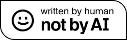

🔔 Do one thing and do it well!

## Methodologies
- [Manifesto for Agile Software Development](https://agilemanifesto.org/iso/en/manifesto.html)
- [Continuous Delivery](https://martinfowler.com/bliki/ContinuousDelivery.html)
- [Enterprise Integration Using REST](https://martinfowler.com/articles/enterpriseREST.html)
- [TOGAF](https://www.opengroup.org/togaf)
- [Digital Platform Strategy](https://www.thoughtworks.com/what-we-do/enterprise-modernization-platforms-cloud/digital-platform-strategy)
- [DevSecOps](https://www.devsecops.org)
- [Platform Engineering](https://platformengineering.org/blog/what-is-platform-engineering)
- [Building Infrastructure Platforms](https://martinfowler.com/articles/building-infrastructure-platform.html)
- [SAFE 5 CALMR](https://www.scaledagileframework.com/calmr/)
- [Cynefin Framework](https://en.wikipedia.org/wiki/Cynefin_framework) 
- [Tunck Based Development](https://trunkbaseddevelopment.com/)
- [Team Topologies](https://teamtopologies.com/key-concepts)

## Principles
- [Semantic Versioning 2.0.0](https://semver.org)
- [The Tweleve-Factor App](https://12factor.net)
- [CAP theorem](https://en.wikipedia.org/wiki/CAP_theorem)
- [MECE](https://en.wikipedia.org/wiki/MECE_principle)
- [Test Double](http://xunitpatterns.com/Test%20Double.html)
- [Mocks Aren't Stubs](https://martinfowler.com/articles/mocksArentStubs.html)
- [SOLID](https://en.wikipedia.org/wiki/SOLID)
- [KISS](https://people.apache.org/~fhanik/kiss.html)

## Concepts
- [CNCF Landscape](https://landscape.cncf.io)
- [SLA vs. SLO vs. SLI](https://www.atlassian.com/incident-management/kpis/sla-vs-slo-vs-sli)

## Tools
- [Lean Value Tree](https://openpracticelibrary.com/practice/lean-value-tree/)
- [Kubernetes Handbook](https://jimmysong.io/kubernetes-handbook/)
- [Technology Radar](https://www.thoughtworks.com/radar)

## Others
